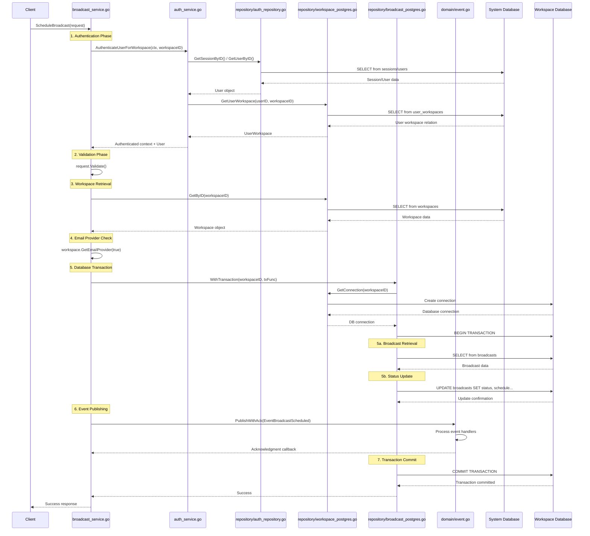

# Complete ScheduleBroadcast Flow Diagram - All Files Involved

This diagram shows the complete flow from `ScheduleBroadcast` method to all files and components it interacts with.

## Architecture Overview

```mermaid
flowchart TB
    subgraph "HTTP Layer"
        CLIENT[Client Request]
        HANDLER[HTTP Handler]
    end

    subgraph "Service Layer"
        BS[broadcast_service.go<br/>ScheduleBroadcast()]
        AS[auth_service.go<br/>AuthenticateUserForWorkspace()]
        WS[workspace_service.go]
    end

    subgraph "Domain Layer"
        REQ[domain/broadcast.go<br/>ScheduleBroadcastRequest.Validate()]
        WS_DOM[domain/workspace.go<br/>Workspace.GetEmailProvider()]
        EVENT[domain/event.go<br/>EventPayload]
        LOGGER[pkg/logger<br/>Logger]
    end

    subgraph "Repository Layer"
        BR[repository/broadcast_postgres.go<br/>BroadcastRepository]
        WR[repository/workspace_postgres.go<br/>WorkspaceRepository]
        AR[repository/auth_repository.go<br/>AuthRepository]
    end

    subgraph "Database Layer"
        SYS_DB[(System Database<br/>PostgreSQL)]
        WS_DB[(Workspace Database<br/>PostgreSQL)]
        INIT[database/init.go<br/>Database Connection]
    end

    subgraph "Event System"
        EB[domain/event.go<br/>InMemoryEventBus]
        HANDLERS[Event Handlers<br/>Background Processing]
    end

    subgraph "Configuration"
        CONFIG[config/config.go<br/>Database Config]
        CRYPTO[pkg/crypto<br/>Encryption]
    end

    CLIENT --> HANDLER
    HANDLER --> BS

    BS --> AS
    BS --> REQ
    BS --> WS_DOM
    BS --> BR
    BS --> WR
    BS --> EB
    BS --> LOGGER

    AS --> AR
    AS --> WR

    REQ --> LOGGER
    WS_DOM --> LOGGER

    BR --> WS_DB
    BR --> WR
    WR --> SYS_DB
    WR --> INIT
    AR --> SYS_DB

    EB --> HANDLERS
    EB --> LOGGER

    WR --> CONFIG
    WR --> CRYPTO
    INIT --> CONFIG

    classDef serviceFile fill:#e1f5fe,stroke:#0277bd,stroke-width:2px
    classDef domainFile fill:#f3e5f5,stroke:#7b1fa2,stroke-width:2px
    classDef repoFile fill:#e8f5e8,stroke:#2e7d32,stroke-width:2px
    classDef dbFile fill:#fff3e0,stroke:#ef6c00,stroke-width:2px
    classDef configFile fill:#fce4ec,stroke:#c2185b,stroke-width:2px

    class BS,AS,WS serviceFile
    class REQ,WS_DOM,EVENT,LOGGER domainFile
    class BR,WR,AR repoFile
    class SYS_DB,WS_DB,INIT dbFile
    class CONFIG,CRYPTO,EB,HANDLERS configFile
```

## Detailed Flow Sequence



## File Dependencies Tree

```
broadcast_service.go
├── domain/
│   ├── broadcast.go (ScheduleBroadcastRequest, BroadcastStatus)
│   ├── workspace.go (Workspace, GetEmailProvider)
│   ├── event.go (EventBus, EventPayload, InMemoryEventBus)
│   ├── auth.go (AuthService interface)
│   └── user.go (User, UserWorkspace)
├── service/
│   └── auth_service.go (AuthenticateUserForWorkspace)
├── repository/
│   ├── broadcast_postgres.go
│   │   ├── WithTransaction()
│   │   ├── GetBroadcastTx()
│   │   ├── UpdateBroadcastTx()
│   │   └── workspace_postgres.go (GetConnection)
│   ├── workspace_postgres.go
│   │   ├── GetByID()
│   │   ├── GetConnection()
│   │   ├── GetUserWorkspace()
│   │   └── database/init.go (ConnectToWorkspace)
│   └── auth_repository.go
│       ├── GetSessionByID()
│       ├── GetUserByID()
│       └── VerifyUserSession()
├── database/
│   ├── init.go (Database connections)
│   └── schema/ (Database schemas)
├── pkg/
│   ├── logger/ (Logging interface)
│   └── crypto/ (Encryption utilities)
└── config/
    └── config.go (Database configuration)
```

## Component Interactions

### 1. **Authentication Flow**

- `auth_service.go` → `auth_repository.go` → System Database
- Validates user sessions and workspace membership
- Returns authenticated context with user information

### 2. **Workspace Data Flow**

- `workspace_postgres.go` → System Database (workspace metadata)
- `workspace_postgres.go` → Workspace Database (connection management)
- Handles email provider configuration retrieval

### 3. **Broadcast Transaction Flow**

- `broadcast_postgres.go` → `workspace_postgres.go` (for DB connection)
- Database transaction management with rollback capabilities
- Status updates and schedule information persistence

### 4. **Event System Flow**

- `InMemoryEventBus` in `domain/event.go`
- Asynchronous event processing with acknowledgment callbacks
- Background task scheduling and processing

### 5. **Database Management**

- **System Database**: User accounts, workspaces, authentication
- **Workspace Databases**: Broadcast data, contacts, templates
- Connection pooling and transaction management

## Key Files Summary

| File                    | Responsibility               | Key Methods                                |
| ----------------------- | ---------------------------- | ------------------------------------------ |
| `broadcast_service.go`  | Main service orchestration   | `ScheduleBroadcast()`                      |
| `auth_service.go`       | User authentication          | `AuthenticateUserForWorkspace()`           |
| `broadcast_postgres.go` | Broadcast persistence        | `WithTransaction()`, `UpdateBroadcastTx()` |
| `workspace_postgres.go` | Workspace data & connections | `GetByID()`, `GetConnection()`             |
| `domain/event.go`       | Event system                 | `PublishWithAck()`                         |
| `domain/broadcast.go`   | Domain models & validation   | `Validate()`, status enums                 |
| `domain/workspace.go`   | Workspace domain logic       | `GetEmailProvider()`                       |
| `database/init.go`      | Database connectivity        | `ConnectToWorkspace()`                     |

## Data Flow Patterns

1. **Request → Service → Repository → Database**
2. **Authentication → Authorization → Data Access**
3. **Transaction → Event → Background Processing**
4. **Validation → Business Logic → Persistence**

This comprehensive flow ensures data consistency, proper authentication, and reliable event processing for broadcast scheduling operations.
